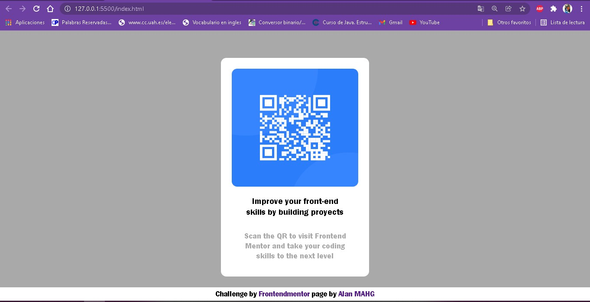
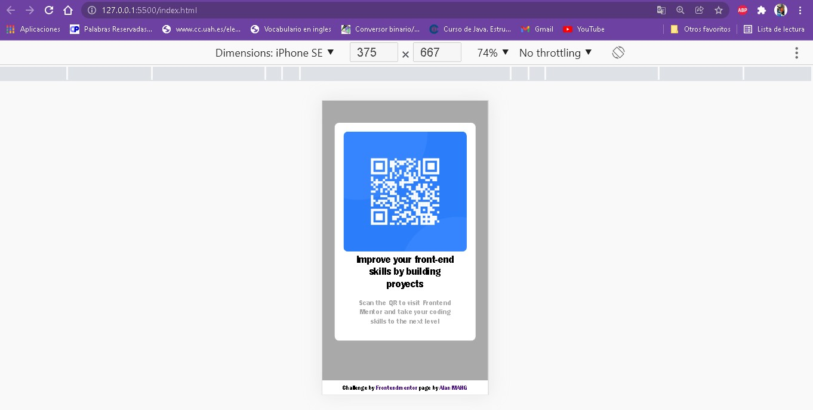

# Frontend Mentor - QR code component solution

This is a solution to the [QR code component challenge on Frontend Mentor](https://www.frontendmentor.io/challenges/qr-code-component-iux_sIO_H). Frontend Mentor challenges help you improve your coding skills by building realistic projects. 

## Table of contents

- [Overview](#overview)
  - [Screenshot](#screenshot)
  - [Links](#links)
- [My process](#my-process)
  - [Built with](#built-with)
  - [What I learned](#what-i-learned)
  - [Continued development](#continued-development)
  
- [Author](#author)
- [Acknowledgments](#acknowledgments)

**Note: Delete this note and update the table of contents based on what sections you keep.**

## Overview
Building a realistic proyect to looking for practice my HTML and CSS coding skills

### Screenshot




### Links

- Solution URL: [Add solution URL here](https://your-solution-url.com)
- Live Site URL: [Add live site URL here](https://your-live-site-url.com)

## My process

-Phase 1: Tackle the proyect based on evidence presented.
The purpose on this phase is find the possible CSS styles we need to implement for design the web page.
-Phase 2: Building web page.
We start the web page design whit contents and structure basicali in HTML.
Next to we start to assigning CSS styles to build the web according to the design shown.
-Phase 3: Responsive design.
Finally we work on web page adaptability, giving a range from 375px to 1440px.
### Built with

- Semantic HTML5 markup
- CSS custom properties
- Flexbox
- Mobile-first workflow

### What I learned

The bigest challenge of the proyect in my learning it was to build a responsive web page.

```css
@media screen and (min-width:481px) and (max-width:780px) {
    body{
        height: 100vh;
        padding-top: 20px;
        width: 100vw;
    }
    section{
        height: 90%;
        width: 80%;
    }
    section img{
        width: 100%;
        height: 55%;
    }
    h4{
        font-size: 2.5em;
        height: 25%;
        width: 100%;
    }
    p{
        font-size: 1.4em;
        height: 20%;
        width: 100%;
    }
}
@media screen and (min-width:781px) and (max-width:1024px) {
    body{
        height: 100vh;
        padding-top: 50px;
        width: 100vw;
    }
    section{
        height: 80%;
        width: 35%;
    }
    section img{
        width: 100%;
        height: 55%;
    }
    h4{
        font-size: 1.7em;
        height: 25%;
        width: 100%;
    }
    p{
        font-size: 1.2em;
        height: 20%;
        width: 100%;
    }
}
@media screen and (min-width:1025px) and (max-width:1440px) {
    body{
        height: 100vh;
        padding-top: 50px;
        width: 100vw;
    }
    section{
        height: 90%;
        width: 25%;
    }
    section img{
        width: 100%;
        height: 60%;
    }
    h4{
        font-size: 1em;
        height: 20%;
        width: 100%;
    }
    p{
        font-size: .9em;
        height: 20%;
        padding: 0px 20px 0px 20px;
        width: 100%;
    }
}
```


### Continued development

Check the responsive design because have a little problem within viewpot measures.


## Author

- Website - [Alan Granados](https://github.com/AlanMAHG)
- Frontend Mentor - [@AlanMAHG](https://www.frontendmentor.io/profile/AlanMAHG)


## Acknowledgments

This proyect was made by Alan, thanks to instructions and indicatios from frontendmentor, bacause they gave me and excelent guide to do this proyect

